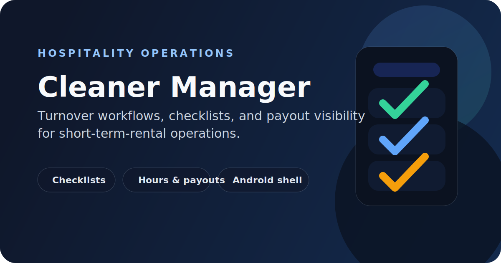

# Cleaner Manager



Cleaner workflow software for short-term-rental turnovers, checklists, hours, and payout visibility.

## Problem

Hospitality turnovers are hard to run well when schedules, checklists, supplies, proof of completion, and payout tracking are spread across chat threads and manual admin work.

## Solution

Cleaner Manager gives hosts and invited cleaners a single operational workspace for recurring turnover work. Cleaners get a mobile-first app for assigned jobs, while hosts can manage templates, guides, schedules, and workflow oversight from the web dashboard.

## Key Features

- Assigned cleaning events and daily workflow views
- Step-by-step turnover checklists with proof-photo support
- Shopping and supply requests linked to operational work
- Property guides and instructions for field teams
- Logged work hours with payout status visibility
- Host-side checklist template management and onboarding flows
- Capacitor Android app shell for cleaner-facing mobile use

## Stack

- Vite, React, TypeScript, Tailwind CSS
- Supabase for auth, database, storage, and Edge Functions
- Capacitor for Android packaging

## Architecture

- `src/` contains the mobile-first React application for hosts and cleaners.
- `supabase/` contains schema, policies, and operational Edge Functions.
- `scripts/start-local-backend.sh` boots the local Supabase stack and writes `.env.local`.
- `android/` contains the Capacitor wrapper for the cleaner app.

## Run Locally

### Requirements

- Node.js 20+
- npm
- Supabase CLI
- Docker runtime

If you use Colima on macOS, run it with `sshfs` mounts so the local Supabase stack can start cleanly.

### Start the Web App

```sh
npm install
cp .env.example .env.local
npm run local:backend
npm run dev
```

The local scripts start Supabase, skip the logging sidecars that are unnecessary for development, and write the active local connection values into `.env.local`.

### Daily Workflow

```sh
npm run local:backend
npm run dev
```

Stop the local backend with:

```sh
npm run local:stop
```

### Android Build

Requirements:

- Node.js 20+
- Java 21
- Android SDK

First-time setup:

```sh
npm install
npm run android:add
```

Build a debug APK:

```sh
npm run android:build:debug
```

Open the native project:

```sh
npm run android:open
```

## Local Endpoints

- App: `http://127.0.0.1:8080`
- Supabase API: `http://127.0.0.1:54321`
- Supabase Studio: `http://127.0.0.1:54323`
- Mailpit: `http://127.0.0.1:54324`

## Current Status

- Active operations product with both web and Android delivery paths
- Local backend workflow is documented and reproducible
- Public production domain: `https://www.cleannermanager.com`
- Android release packaging is prepared, while package identifiers remain aligned with the existing domain and app registration

## Production Scheduling

Production automation is triggered through GitHub Actions and Supabase Edge Functions:

- iCal sync
- notification dispatch
- scheduled payouts

Deployment wiring for those jobs, including the required `SUPABASE_CRON_SECRET` and Supabase `CRON_SECRET`, is documented in [docs/deployment/scheduled-operations.md](docs/deployment/scheduled-operations.md).

## Why It Matters

This project shows applied STR operations work: not just a dashboard, but a workflow system designed to reduce coordination overhead around turnovers, staff execution, and payout visibility.
